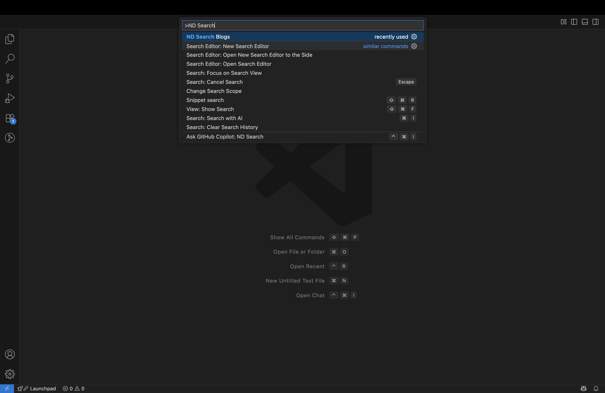
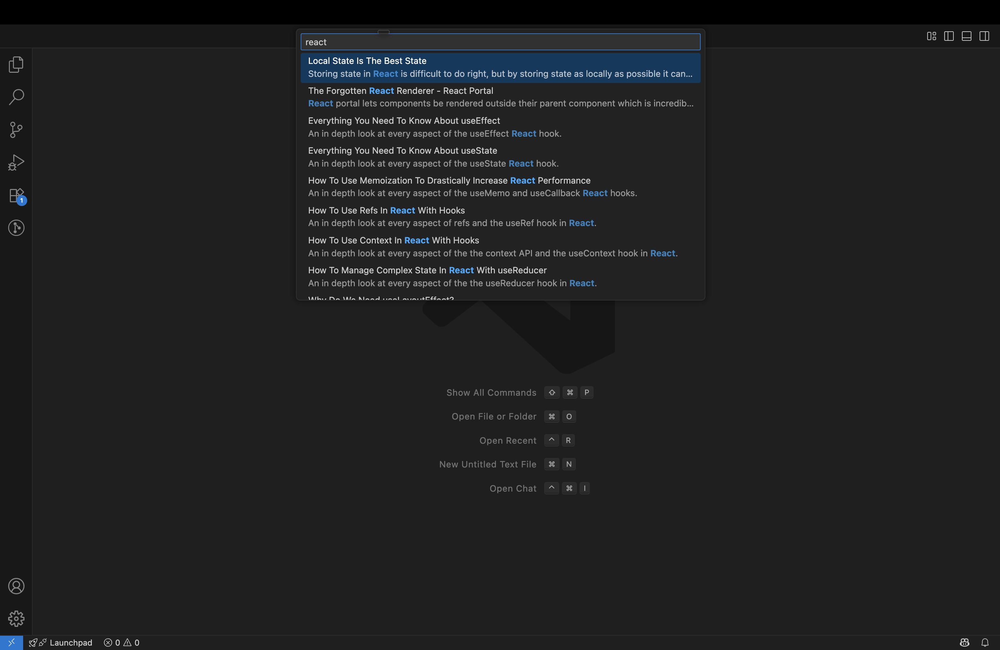

  <h1>ND Search Blog</h1>

  <strong>👤 Publisher: N D Ranasinghe</strong>

  

<h1>Overview</h1>

  ND Search Blog brings the power of <a href="https://blog.webdevsimplified.com">Web Dev Simplified</a> to your VS Code! Search and explore blog articles directly from the VS Code search bar, making it easy to find web development insights without leaving your editor.

<h1>✨ Features</h1>

  - <strong>⚡ Instant Blog Search</strong>: Access all Web Dev Simplified articles with a single command. 
  - <strong>🔎 Quick Filtering</strong>: Type in the Quick Pick to filter articles by title or description. 
  - <strong>🖱️ One-Click Access</strong>: Open articles in your browser with a single click. 
  - <strong>🚄 Fast & Lightweight</strong>: Built for speed using <code>axios</code> and <code>fast-xml-parser</code>.

<h1>⬇️ Installation</h1>

  1. Open VS Code and go to the Extensions view (<code>Ctrl+Shift+X</code> or <code>Cmd+Shift+X</code> on macOS). 
  2. Search for <strong>ND Search Blog</strong> by <strong>N D Ranasinghe</strong>. 
  3. Click <strong>Install</strong>.

<h1>🛠️ How to Use</h1>

  1. Open the Command Palette (<code>Ctrl+Shift+P</code> or <code>Cmd+Shift+P</code> on macOS). 
  2. Type <code>>ND Search Blog</code> and press Enter. 
    

  3. Browse all Web articles or type what you want to filter by title/description. 
    

  4. Select an article to open it in your default browser.

<h1>📦 Requirements</h1>

  - VS Code version <strong>1.103.0</strong> or higher. 
  - 🌐 Internet connection to fetch the blog's RSS feed.

<h1>🐞 Known Issues</h1>

  - Depends on the availability of the Web Dev Simplified RSS feed. 
  - Limited to articles in the RSS feed at activation time.

<h1>💬 Feedback</h1>

  Love the extension? Have suggestions? Report issues or contribute ideas via the <a href="https://github.com/Dilusha-Ranasingha/Search-Blog-VS-Extension">GitHub repository</a>

  <strong style="font-size:1.2em;">🎉 Happy Coding with ND Search Blog! 🚀</strong> 
  <em>Empowering your web development journey, one search at a time. 💻🔍</em>

